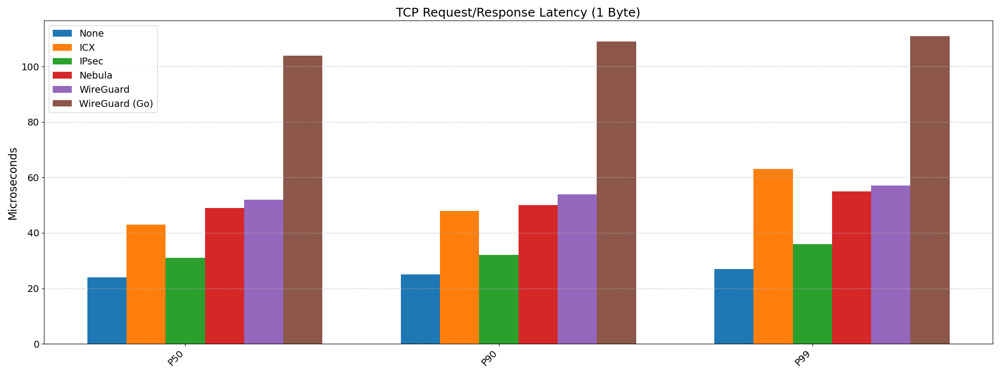

# InterCloud eXpress (ICX)


ICX is a high-performance, kernel-bypass VPN solution for cloud environments.

## Features

* UDP/Geneve based.
* Layer 3 tunneling (IPv4 and IPv6).
* Kernel-bypass using [AF_XDP](https://docs.kernel.org/networking/af_xdp.html).
* AES-GCM-128 crypto with [replay protection](https://datatracker.ietf.org/doc/html/rfc6479).
* Cryptokey routing (a la. WireGuard's allowed_ips).
* Control/data-plane separation (like IPsec, allows for pluggable auth).

## Notes

On Debian you might need to create this symlink to fix bpf compilation issues:

```shell
sudo ln -sf /usr/include/$(uname -m)-linux-gnu/asm /usr/include/asm
```

## Performance

2 x [c7gn.2xlarge](https://aws.amazon.com/ec2/instance-types/c7g/) instances in the same us-west-2 availability zone with a cluster placement strategy.



