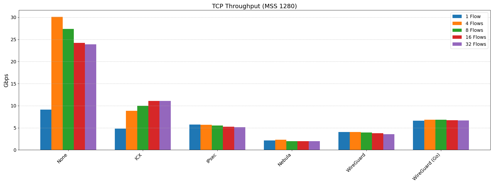

# InterCloud eXpress (ICX)


ICX is a high-performance, kernel-bypass VPN solution for cloud environments.

## Notes

On Debian you might need to create this symlink to fix bpf compilation issues:

```shell
sudo ln -sf /usr/include/$(uname -m)-linux-gnu/asm /usr/include/asm
```

## Performance

2 x [c7gn.2xlarge](https://aws.amazon.com/ec2/instance-types/c7g/) instances in the same us-west-2 availability zone with a cluster placement strategy.


